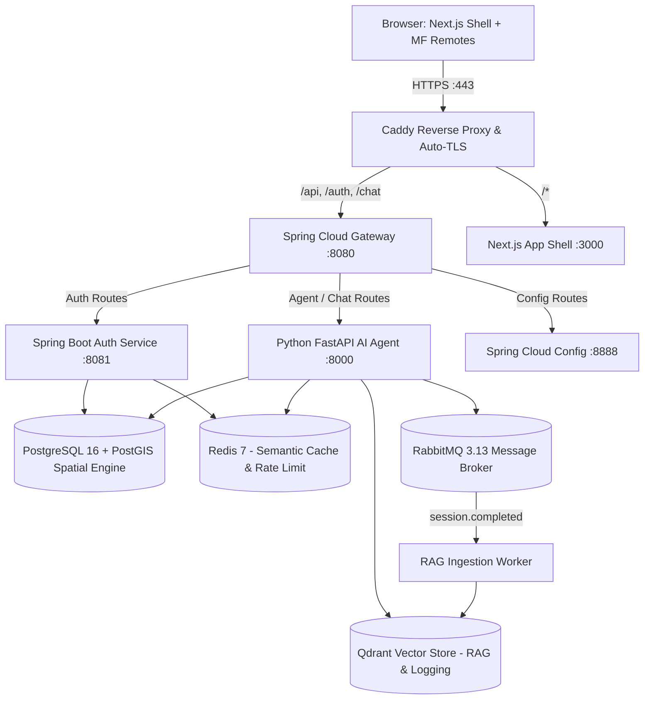

# TradiePulse Architecture Specification

**Target:** `tradiepulse.mainuddintalukdar.cloud`  
**Region:** New Zealand (Christchurch primary focus)

---

## 1. System Topology

TradiePulse connects New Zealand customers with nearby qualified, verified tradespeople (plumbers, electricians, mechanics) through a text-first conversational AI agent with real-time matching and an admin-supervised job lifecycle.

---

## 2. Core Service Architecture

| Service | Technology | Role & Trade-offs |
|---|---|---|
| **Meta-Repo** | Git Submodules | Unified orchestration without mono-repo bloat or nested clone side-effects. |
| **Frontend** | Next.js App Shell + React/TS Module Federation | Independent team deployability for `customer-portal`, `tradie-portal`, `admin-console`, and `chat-widget`. |
| **API Gateway** | Spring Cloud Gateway (Java 21 Reactive) | Edge JWT verification, Redis token-bucket rate limiting, CORS, W3C trace propagation, RFC 7807 problem json. |
| **Auth Service** | Spring Boot 3 + Spring Authorization Server | Argon2id password hashing, rotating JWT refresh token family, 48h activation links, step-up security questions for impersonation. |
| **Config Service** | Spring Cloud Config Server | Centralized Git-backed and native configuration profiles with `{cipher}` encrypted secrets. |
| **AI Agent** | Python 3.12 + FastAPI + LangGraph | Transport-agnostic deterministic state machine, Pydantic v2 schema gates, OpenRouter multi-model router + Groq fallback, Redis semantic cache, Qdrant interaction logging & RAG. |
| **Database** | PostgreSQL 16 + PostGIS + Supabase compatibility | Spatial indexing (`GEOGRAPHY(Point,4326)` GiST) for `nearest_available_qualified` matching, job state machines, immutable audit trails. |
| **Email** | Resend API | 48-hour customer activations, admin invitations, tradesperson verification notices, deployment reports. |

---

## 3. Microservice Contracts & Data Boundaries

### 3.1 Authentication & Tokens
- **Access Token:** Short-lived (15 min) asymmetric RS256/HS256 signed JWT containing `sub`, `roles`, `email`, `act_as` (for impersonation).
- **Refresh Token:** Rotating opaque token family; token reuse instantly revokes the entire token family.
- **Defence in Depth:** Gateway validates token at the perimeter and forwards `X-User-Id` / `X-User-Roles`; internal services re-validate cryptographic signatures.

### 3.2 Impersonation Step-Up Protocol
1. Admin requests impersonation of customer/tradie ID.
2. System challenges Admin with target user's pre-configured security questions.
3. Upon verified answers, Auth Service issues short-lived `act_as` JWT with explicit impersonation flag.
4. UI renders sticky red warning banner.
5. All actions during session write immutable entries to `audit.audit_log` with `correlation_id`, `admin_id`, and `impersonated_user_id`.
6. Critical operations (changing email, password, withdrawing funds) are strictly forbidden under impersonation.
